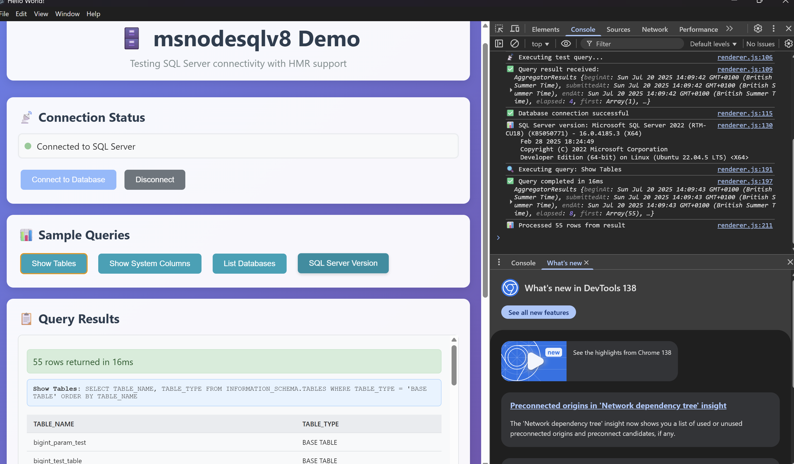

# msnodesqlv8-electron

A demo Electron application for testing SQL Server connectivity with Hot Module Replacement (HMR) support using msnodesqlv8.

## Features

- SQL Server database connectivity
- Real-time query execution
- Connection status monitoring
- Sample queries for testing
- Hot Module Replacement (HMR) support

## Screenshot



*Note: Add a screenshot of your application as `screenshot.png` in the project root to display it here.*

## Installation

```sh
npm install
node_modules/.bin/electron-rebuild
```

## Usage

Run the application to test SQL Server connectivity and execute sample queries.
